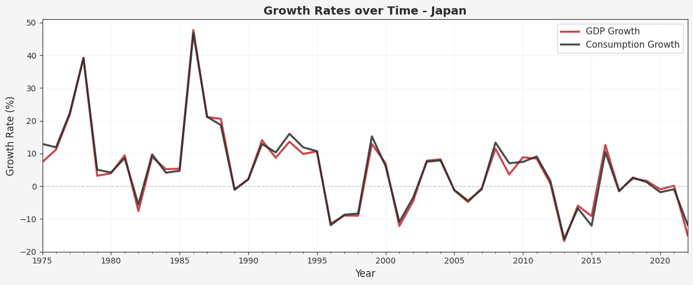
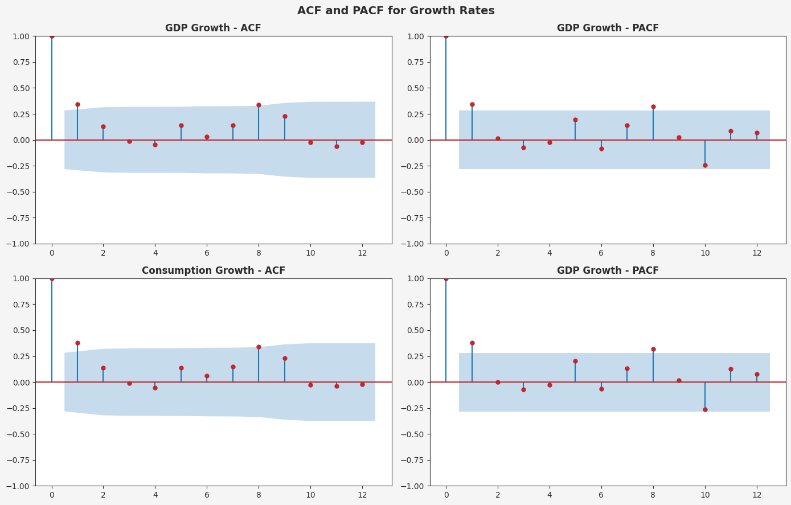

# VAR Model Analysis: Japan GDP and Consumption per capita

## Project Overview
Time series analysis of Japan's GDP per capita and consumption per capita using ARMA and VAR models to examine the dynamic relationships.

## Data Source
World Bank API (1990-2023)

## Repository Structure
```
├── data_collection.ipynb -> Data fetching and pre-processing
├── analysis.ipynb -> Time series analysis
├── japan_data.csv -> Processed Dataset
├── acf_pacf_plots.png -> Autocorrelation plots
├── requirements.txt -> Libraries required
├── .gitignore
└── README.md -> This file
```
## Methodology

### 1. Data Collection
- Fetched the annual data from World Bank API for a period of 48 years from 1974 to 2022
- Variables: GDP per capita (NY.GDP.PCAP.CD) and Consumption per capita (Calculated from NE.CON.PRVT.CD / SP.POP.TOTL)

### 2. Growth Rate Calculation
- Growth rate calculated as percentage changes, growth rate = ((X_t - X_t-1) / X_t-1) x 100

### 3. Stationarity Testing
- Method: Augmented Dickey-Fuller (ADF) test
- Null Hypothesis: Series has unit root (non-stationary)
- Significance Level: 5%
- Iterative differencing applied until both series achieved stationarity

### 4. ARMA Model Selection
- Tested: ARMA (p,q) for p,q ∈ {1,2,3,4}
- Criteria: AIC and BIC
- Method: Box-Jenkins methodology
- Seprate models estimated for GDP growth and Consumption growth

### 5. VAR Model Selection
- Tested: VAR(p) for p ∈ {1,2,3,4}
- Criteria: AIC and BIC
- Multi-variate model capturing dynamic relationships between GDP and Consumption

### 6. Granger Causality Tests
- Tests bidirectional causality
- Maximum lags: 4
- Test Statistic: F-test
- Significance Level: 5%

## Key Results

### Stationarity
- GDP Growth Rate: Stationary
- Consumption Growth Rate: Stationary
- Differencing applied: 1 Time

### ARMA Model Selection

#### GDP Growth
- Best model by AIC: ARMA(2,2)
- Best model by BIC: ARMA(1,0)

#### Consumption Growth
- Best model by AIC: ARMA(2,4)
- Best model by BIC: ARMA(1,0)

### VAR Model Selection
- Best model by AIC: VAR(3)
- Best model by AIC: VAR(1)

### Granger Causality

Question: Does consumption Granger-cause GDP or the other way around?
Answer: No

## Visualizations

### GDP and Consumption Growth Rate Plot


### ACF and PACF plots


## Requirements
### Python Packages
- pandas
- numpy
- matplotlib
- statsmodels
- wbgapi

### Installation
pip install -r requirements.txt

## Technical Notes
- **Sample Size**: Sufficient for reliable inference (n >= 30)
- **Information Criteria**: AIC tends to select more complex models, BIC penalizes complexity more
- **Granger Causality Interpretation**: No causality


*This project was completed as part of the Time Series Analysis by Prof. Anindya S. Chakrabarti in the Post Graduate Diploma in Advanced Business Analytics program at IIM Ahmedabad.*